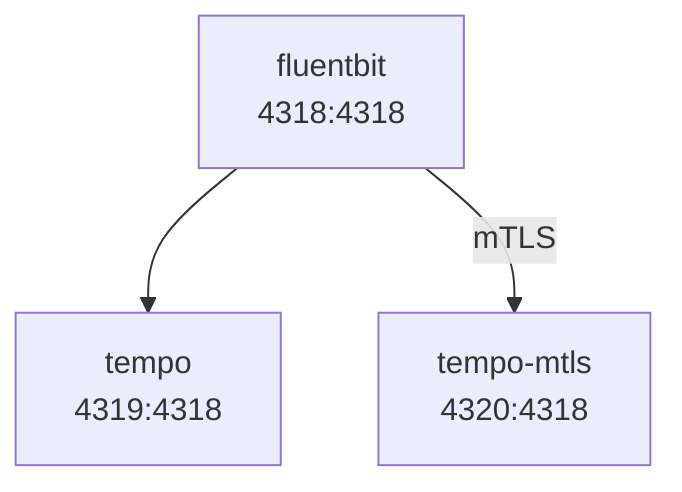

# fluent-bit-repro

## Introduction

This repository serves as a minimal reproducer for an mTLS issue with Fluent Bit.

The main issue is that the `opentelemetry` output plugin doesn't appear to work with mTLS. The plugin shows the following error when trying to flush data to the `opentelemetry` backend with mTLS enabled:

```
[error] [output:opentelemetry:opentelemetry.1] <HOST>:4318, HTTP status=0
```

To reproduce the issue, this repository contains a `docker-compose.yaml` file with the following configuration:

- A [Grafana Tempo](https://github.com/grafana/tempo) container _without_ mTLS enabled
- A Grafana Tempo container _with_ mTLS enabled
- A Fluent Bit container with:
  - Two `opentelemetry` output plugins that are configured to talk to each of the Grafana Tempo backends above
  - One `opentelemetry` input plugin that is configured without mTLS
- A shell script to generate mTLS certificates

The diagram below represents the `docker-compose` setup visually.
The ports published are shown using `HOST_PORT:CONTAINER_PORT` syntax.
Users can communicate with the individual services using the `HOST_PORT`s and the containers can communicate with each other using the `CONTAINER_PORT`s.



## Steps to Reproduce

> **NOTE**: You will need `openssl`, [`protocurl`](https://github.com/qaware/protocurl), `docker`, and `docker-compose` installed for the steps below.

Generate mTLS certificates (`sudo` will prompt you for a password, this is necessary to change ownership of the certs for the Docker volumes):

```sh
./certs/generate.sh
```

Start the containers:

```sh
docker-compose up
```

From the root of this repository on your local system, send the example `trace.json` data to the Fluent Bit container:

```sh
protocurl \
 -i opentelemetry.proto.collector.trace.v1.ExportTraceServiceRequest \
 -o opentelemetry.proto.collector.trace.v1.ExportTraceServiceResponse \
 -u http://localhost:4318/v1/traces \
 -d @trace.json -I op -D
```

The Fluent Bit `opentelemetry` input plugin should return a `2XX` response indicating that the request was received successfully.

However, the Fluent Bit `opentelemetry` ouput plugin that connects to the mTLS backend should throw the following error:

```
[error] [output:opentelemetry:opentelemetry.1] tempo-mtls:4318, HTTP status=0
```

Sending the example trace data directly to the Tempo backend (e.g. not through Fluent Bit) with the same mTLS certificates works without any issues, indicating that the certificates are not the issue:

```sh
# sudo is used since the generated certs are owned by the root user
sudo protocurl \
  -i opentelemetry.proto.collector.trace.v1.ExportTraceServiceRequest \
  -o opentelemetry.proto.collector.trace.v1.ExportTraceServiceResponse \
  -u https://localhost:4320/v1/traces \
  -C '--cert ./certs/generated/fb/cert.pem --key ./certs/generated/fb/key.pem --cacert ./certs/generated/fb/ca.pem' \
  -d @trace.json -I op -D
```

The `opentelemetry` output plugin instance that connects to the non-mTLS Grafana Tempo backend does not throw any errors in the Fluent Bit logs.

## Summary of services/ports/outcomes

The table below shows a summary of the results of using `protocurl` to send the trace data to each of the Open Telemetry endpoints:

| Service         |             Endpoint             | Certs provided with protocurl? | Expected Behavior |                                                Actual Behavior                                                 |
| :-------------- | :------------------------------: | -----------------------------: | ----------------: | :------------------------------------------------------------------------------------------------------------: |
| FluentBit       | http://localhost:4318/v1/traces  |                             No |         No errors | `opentelemetry` input plugin accepts trace data successfully, but output plugin fails to flush to mTLS backend |
| Tempo (no mTLS) | http://localhost:4319/v1/traces  |                             No |         No errors |                                                   No errors                                                    |
| Tempo (mTLS)    | https://localhost:4320/v1/traces |                            Yes |         No errors |                                                   No errors                                                    |
